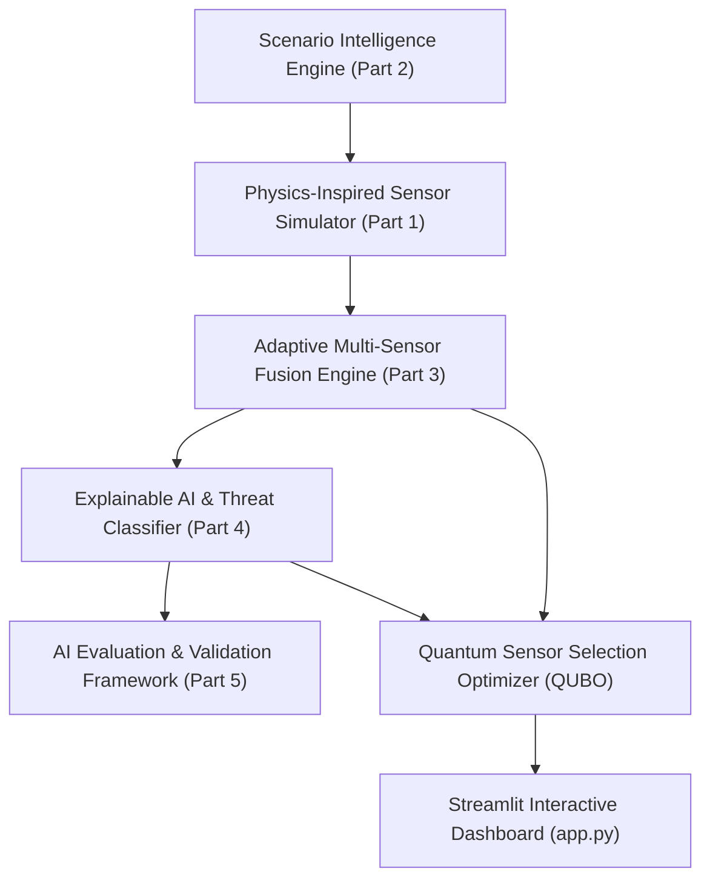

# AEGIS-X — System Architecture & Integration Guide

## 1. Overview
AEGIS-X is a research-inspired, physics-based, explainable AI, and quantum-enhanced multi-sensor stealth detection architecture. The system simulates complex aerial target profiles, models atmospheric physics across 5 sensing modalities, executes adaptive multi-sensor fusion, performs explainable AI threat classification, evaluates performance metrics, and solves QUBO quantum sensor selection.

---

## 2. End-to-End System Pipeline



---

## 3. Core Module Specifications

### Part 1: Physics-Inspired Sensor Simulator (`simulator/`)
- **Radar Model**: Radar Range Equation incorporating target Radar Cross Section ($\sigma$), $R^{-4}$ path loss, atmospheric rain/fog RF attenuation, stealth reduction, and active Electronic Countermeasure (ECM) jamming degradation.
- **Infrared (IR) Model**: Stefan-Boltzmann radiation based on engine heat flux and Beer-Lambert atmospheric extinction ($e^{-\gamma_{atm} R}$).
- **Thermal Model**: Aerodynamic skin friction heating ($T_{skin} = T_{ambient}(1 + 0.2 M^2)$) and thermal contrast.
- **Acoustic Model**: Inverse-square spherical propagation loss ($SPL(R) = SPL_0 - 20\log_{10}(R) - \alpha_{ac} R$) and ambient weather noise floor.
- **Electro-Optical (EO) Camera Model**: Koschmieder optical contrast transmittance ($C(R) = C_0 e^{-\sigma_{vis} R}$) and day/night solar illuminance.

### Part 2: Scenario Intelligence Engine (`simulator/scenario_engine.py`)
- **12 Mission Templates**: Commercial Flight, Cargo Flight, Reconnaissance, Stealth Penetration, Border Surveillance, Drone Patrol, Cruise Missile Attack, Helicopter Search, Bird Activity, Unknown Intrusion, Search & Rescue, Custom.
- **7 Target Profiles**: Commercial Aircraft, Stealth Fighter, Recon Drone, Cruise Missile, Helicopter, Bird, Unknown Object.
- **Validation Engine**: Physical rule checks enforcing speed/altitude ceilings, hover prevention, and stealth vs RCS consistency.
- **8 Predefined Demo Presets**: Deterministic scenario presets for demonstrations.

### Part 3: Adaptive Multi-Sensor Fusion Engine (`fusion/fusion.py`)
- **6-Stage Pipeline**: Input Sanitization $\rightarrow$ Health Assessment $\rightarrow$ Environmental Adaptation $\rightarrow$ Noise Compensation $\rightarrow$ Weighted Consensus Fusion $\rightarrow$ Disagreement & Uncertainty Analysis $\rightarrow$ Explainability.
- **Dynamic Weighting**: Weights adapt dynamically based on weather (e.g. Radar down in Heavy Rain/Jamming, IR/Thermal up) and health states (`Healthy`, `Slightly Degraded`, `Degraded`, `Jammed`, `Faulty`, `Offline`).

### Part 4: Explainable AI & Threat Classifier (`ai/predict.py`)
- **Target Taxonomy Classifier**: Multi-class classification across 7 target profiles.
- **Decision Attribution**: Feature importance calculation across 8 input dimensions.
- **Contextual Threat Level**: Evaluates threat categories (`Low`, `Medium`, `High`, `Critical`).
- **Tactical Recommendations**: Generates actionable tactical guidance.

### Part 5: AI Evaluation & Validation Framework (`evaluation/runner.py`)
- **Automated Scenario Runner**: Runs batch scenario evaluations.
- **Performance Metrics**: Accuracy, Precision, Recall, F1, Detection Rate, False Alarm Rate, ECE, Per-Class Breakdown.
- **Robustness Sweeps**: Environmental weather sweeps and hardware failure sweeps.
- **Fusion Benchmarking**: Quantifies performance gains comparing Raw Single Sensors vs Fused Adaptive Sensors.
- **Report Persist**: Automatically generates presentation report `evaluation/evaluation_report.md`.

### Part 6: System Pipeline Orchestrator (`src/pipeline.py`)
- **Pipeline Facade**: `run_full_aegis_pipeline(...)` linking all modules.
- **Structured Logging**: Timestamped logging tracking system execution.
- **Centralized Config**: `src/config.py` storing system constants.

---

## 4. API Schema & Data Formats

### Primary Pipeline Execution API
```python
from src.pipeline import run_full_aegis_pipeline

result = run_full_aegis_pipeline(demo_preset=1, seed=42)
```

#### Output Schema
```json
{
  "scenario": {
    "scenario_id": "DEMO-001",
    "distance": 25.0,
    "weather": "Clear",
    "aircraft_type": "Commercial Aircraft",
    "ground_truth": { ... }
  },
  "sensor_scores": {
    "Radar": 0.85,
    "Infrared": 0.62,
    "Thermal": 0.55,
    "Acoustic": 0.40,
    "EO_Camera": 0.70
  },
  "fusion": {
    "fusion_score": 0.68,
    "overall_confidence": 0.61,
    "sensor_weights": { ... },
    "explanation": "..."
  },
  "ai": {
    "prediction": 1,
    "predicted_class": "Commercial Aircraft",
    "threat_level": "Low",
    "confidence": 0.98,
    "reasoning": "...",
    "recommendation": "..."
  },
  "quantum_selection": {
    "Radar": true,
    "Infrared": true,
    "Acoustic": false
  }
}
```

---

## 5. Verification & Test Execution
To execute all 40+ unit and integration tests across the AEGIS-X project:
```bash
python -m unittest discover tests
```
